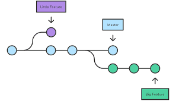

# Инструкция для работы с Git и удалёнными репозиториями


## Что такое Git?

>**Git** *- это одна из реализаций распределённых систем контроля версий, имеющая как и локальные, так и удалённые репозитории. Является самой популярной реализацией систем контроля версий в мире.*

## Подготовка репозитория

Для создание репозитория необходимо выполнить команду *git init*  в папке с репозиторием и у Вас создаться репозиторий (появится скрытая папка .git)

## Сохранение или внесение изменений


### Git add

Для добавления измений в коммит используется команда *git add*. Чтобы использовать команду *git add* напишите:

```git add <имя_файла>```

***

### Просмотр состояния репозитория

Для того, чтобы посмотреть состояние репозитория используется команда *git status*. Для этого необходимо в папке с репозиторием написать *git status*, и Вы увидите были ли измения в файлах, или их не было.
***

### Создание коммитов

Для того, чтобы создать коммит(сохранение) необходимо выполнить команду *git commit*. Выполняется она так: *git commit -m "&lt;сообщение к коммиту&gt;"*. Все файлы для коммита должны быть ***ДОБАВЛЕНЫ*** и сообщение к коммиту писать ***ОБЯЗАТЕЛЬНО***.
***

## Перемещение между сохранениями

Для того, чтобы перемещаться между коммитами, используется команда *git checkout*. Используется она в папке с репозиторием следующим образом: *git checkout &lt;номер_коммита&gt;*

## Журнал изменений

- Для того, чтобы посмотреть все сделанные изменения в репозитории, используется команда ***git log***. Для этого достаточно выполнить команду *git log* в папке с репозиторием.
  - Также можно использовать команду ***git reflog***, она показывает все        действия в репоозитории кратким списком, с сокращенными номерами коммитов.



## Ветки в Git

1. **Создание ветки.**
Для того, чтобы создать ветку, используется команда *git branch*. Делается это следующим образом в папке с репозиторием: *git branch &lt;название_новой_ветки&gt;*

2. **Слияние веток.**
Для того чтобы дабавить ветку в текущую ветку используется команда *git merge &lt;name_branch&gt;*

3. **Удаление веток.**
Для удаления ветки ввести команду *git branch -d &lt;name_branch&gt;*

4. **Создание и переход.**
*git checkout -b &lt;имя_ветки&gt;* - создает новую ветку и переходит в нее.


## Перемещение между директориями

*mkdir &lt;имя_новой_папки&gt;* - создание новой директории, *cd* имя директории - переход в директорию, *cd ../* - переход в нижнию директорию.

## Используемая информация

 [***Статья на GitHub***](https://docs.github.com/en/get-started/writing-on-github/getting-started-with-writing-and-formatting-on-github/basic-writing-and-formatting-syntax)

## Работа с удалёнными репозиториями

Для того, чтобы внести вклад в какой-либо Git-проект, вам необходимо уметь работать с удалёнными репозиториями. Удалённые репозитории представляют собой версии вашего проекта, сохранённые в интернете или ещё где-то в сети. У вас может быть несколько удалённых репозиториев, каждый из которых может быть доступен для чтения или для чтения-записи. Взаимодействие с другими пользователями предполагает управление удалёнными репозиториями, а также отправку и получение данных из них. Управление репозиториями включает в себя как умение добавлять новые, так и умение удалять устаревшие репозитории, а также умение управлять различными удалёнными ветками, объявлять их отслеживаемыми или нет и так далее.

```git remote -v``` *показать список удалённых репозиториев, связанных с локальным*

```git remote remove origin``` *убрать привязку удалённого репозитория с сокр. именем origin*

```git remote add origin https://github.com:nicothin/test.git``` *добавить удалённый репозиторий (с сокр. именем origin) с указанным URL*

```git remote rm origin``` *удалить привязку удалённого репозитория*

```git remote show origin``` *получить данные об удалённом репозитории с сокращенным именем origin*

```git fetch origin``` *скачать все ветки с удаленного репозитория (с сокр. именем origin), но не сливать со своими ветками*

```git fetch origin master``` *то же, но скачивается только указанная ветка*

```git checkout --track origin/github_branch``` *создать локальную ветку ```github_branch``` (данные взять из удалённого репозитория с сокр. именем origin, ветка github_branch) и переключиться на неё*

```git push origin master``` *отправить в удалённый репозиторий (с сокр. именем origin) данные своей ветки master*

```git pull origin``` *влить изменения с удалённого репозитория (все ветки)*

```git pull origin master``` *влить изменения с удалённого репозитория (только указанная ветка)*
