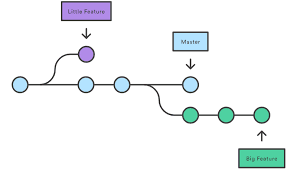

# Инструкция для работы с Git и удалёнными репозиториями


## Что такое Git?

>**Git** *- это одна из реализаций распределённых систем контроля версий, имеющая как и локальные, так и удалённые репозитории. Является самой популярной реализацией систем контроля версий в мире.*

## Подготовка репозитория

Для создание репозитория необходимо выполнить команду *git init*  в папке с репозиторием и у Вас создаться репозиторий (появится скрытая папка .git)

## Сохранение или внесение изменений


### Git add

Для добавления измений в коммит используется команда *git add*. Чтобы использовать команду *git add* напишите:

```text
git add <имя_файла>
```

***

### Просмотр состояния репозитория

Для того, чтобы посмотреть состояние репозитория используется команда *git status*. Для этого необходимо в папке с репозиторием написать *git status*, и Вы увидите были ли измения в файлах, или их не было.
***

### Создание коммитов

Для того, чтобы создать коммит(сохранение) необходимо выполнить команду *git commit*. Выполняется она так: *git commit -m "&lt;сообщение к коммиту&gt;"*. Все файлы для коммита должны быть ***ДОБАВЛЕНЫ*** и сообщение к коммиту писать ***ОБЯЗАТЕЛЬНО***.
***

## Перемещение между сохранениями

Для того, чтобы перемещаться между коммитами, используется команда *git checkout*. Используется она в папке с репозиторием следующим образом: *git checkout &lt;номер_коммита&gt;*

## Журнал изменений

- Для того, чтобы посмотреть все сделанные изменения в репозитории, используется команда ***git log***. Для этого достаточно выполнить команду *git log* в папке с репозиторием.
  - Также можно использовать команду ***git reflog***, она показывает все        действия в репоозитории кратким списком, с сокращенными номерами коммитов.



## Ветки в Git

1. **Создание ветки.**
Для того, чтобы создать ветку, используется команда *git branch*. Делается это следующим образом в папке с репозиторием: *git branch &lt;название_новой_ветки&gt;*

2. **Слияние веток.**
Для того чтобы дабавить ветку в текущую ветку используется команда *git merge &lt;name_branch&gt;*

3. **Удаление веток.**
Для удаления ветки ввести команду *git branch -d &lt;name_branch&gt;*

4. **Создание и переход.**
*git checkout -b &lt;имя_ветки&gt;* - создает новую ветку и переходит в нее.


## Перемещение между директориями

*mkdir &lt;имя_новой_папки&gt;* - создание новой директории, *cd* имя директории - переход в директорию, *cd ../* - переход в нижнию директорию.

## Используемая информация

 [***Статья на GitHub***](https://docs.github.com/en/get-started/writing-on-github/getting-started-with-writing-and-formatting-on-github/basic-writing-and-formatting-syntax)

## Перемещение курсора

Ctrl + a — переход в начало строки
Ctrl + b — переход на 1 символ назад 
Ctrl + c — посылает программе SIGINT. Обычно, прерывает текущее задание
Ctrl + d — удаляет символ под курсором (аналог delete)
Ctrl + e — переход к концу строки
Ctrl + f — переход на 1 символ вперёд
Ctrl + xx — переходит от текущей позиции курса в начало строки и обратно. 

Ctrl + p — Предыдущая команда (Стрелка вверх)
Ctrl + n — Следующая команда (Стрелка вниз)
Alt + b — Переместить курсор на одно слово назад (влево)
Alt + f — Переместить курсор на одно слово вперед (вправо)
Ctrl + b — Переместить курсор на один символ назад (влево)
Ctrl + f — Переместить курсор на один символ вперед (вправо)
Ctrl + xx — Переключение между началом строки и текущей позиции курсора

## Редактирование

Ctrl + L — очищает экран. Аналог команды clear.

Alt + Del — Удалить слово перед курсором.
  Alt + d — Исключить слово после курсора.
 Ctrl + D — Удалить символ под курсором
 Ctrl + H — Удалить символ перед курсором (Backspace)
 Ctrl + Alt + H — Удаление слова перед курсором
 Ctrl + W — Вырезать слово перед курсором в буфер обмена.
 Ctrl + K — Вырезать строки после курсора в буфер обмена.
 Ctrl + U — Вырезать / удалить все символы слева от курсора до начала строки  в буфер обмена.
  Alt + T — Поменять текущее слово с предыдущим
 Ctrl + T — Поменять местами последние два символа перед курсором. Меняет символ под курсором на предыдущий. Или, если хотите, тянет предыдущий символ к концу строки. 
 Esc + T — Поменять местами последние два слова перед курсором.
 Ctrl + Y — Вставить последнюю запись из буфера, которая была вырезана.
  Alt + U — Возвести в ВЕРХНИЙ РЕГИСТР (прописными буквами) все символы от курсора до конца текущего слова.
  Alt + L — Возвести в нижний регистр каждый символ от курсора до конца текущего слова.
  Alt + C — Сделать прописным символ под курсором и перейти к концу слова.
  Alt + R — Отменить изменения. Вернуть команду взятую из истории в исходное состояние.
 Ctrl + _ — Отмена
 Shift + PgUp / PgDown — прокрутку вверх / вниз
Ctrl + X; Ctrl + E — открывает $EDITOR для изменения введённой строки. После сохранения изменений, команда отправляется на исполнение. Если переменная не задана, то открывается системный текстовый редактор (для линукса это, зачастую, nano)
Ctrl + X @ — показывает возможные дополнения имени хоста

TAB - авто дополнение для имен файлов / каталогов
Например, чтобы перейти в каталог 'sample1', введите команду ```cd sam```, затем нажмите TAB и ENTER. Вводите только достаточное количество символов, чтобы однозначно идентифицировать каталог или программу, которую вы хотите открыть.

## История

Ctrl + R — поиск по истории. Повторение поиска (нажмите несколько раз для листания по результам поиска).
Ctrl + P — Предыдущая команда в истории (то есть идти назад по истории команд)
Ctrl + N — Следующая команда в истории (то есть идти вперед по истории команд)
Ctrl + J — прекращает поиск и позволяет отредактировать найденную команду. Если поиск не производился, то аналогично нажатию return. (в zsh выполняет команду)
Ctrl + S — Вернуться к следующему самой последней команде. (Остерегайтесь, чтобы не выполнить его из терминала, потому что это также запустит свой XOFF).
Ctrl + Z — приостановить (suspend) текущую задачу.
Ctrl + O — Выполните команду найденную с помощью Ctrl + R или Ctrl + S
Ctrl + G — Выход из режима поиска
```history | grep regex``` — поиск в истории

!!          — Выполнить еще раз последнюю команду
!! sudo — повторить последнюю команду с правами super user
!abc    — Выполнить последнюю команду, имя которой начинается с abc
!abc:p  — Вывести последнюю команду, имя которой начинается с abc 
!$      — Последний аргумент предыдущей команды
ALT + . — Последний аргумент предыдущей команды
!*      — Все аргументы предыдущей команды
^abc­^­def — Выполнить предыдущую команду, заменив abc на def

## Управление процессом выполнения

Ctrl + C  Прервать/Убить запущенное приложение (SIGINT)
Ctrl + S Остановить вывод на экран (для длительных многословных команд)
             Затем используйте PgUp / PgDn для навигации
  Ctrl + Q Разрешить вывод на экран (если ранее перестали использовать команду выше)
  Ctrl + D Отправить EOF, если не была выключена опция, это закроет текущую оболочку (EXIT)
  Ctrl + Z Послать сигнал SIGTSTP к текущей задаче, которая приостанавливает его.

Установить режим Vim в Bash:
```$ set -o vim```
Установить режим Emacs в Bash:
```$ set -o emacs```
